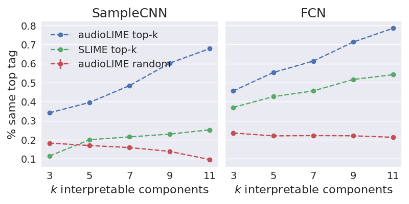

# mml2020-experiments
This repository contains scripts for reproducing the 
[audioLIME](https://github.com/CPJKU/audioLIME/tree/mml2020) 
experiments for our paper
[MML2020 paper (arxiv link)](https://arxiv.org/abs/2008.00582). 



## Setup

* Head to the [audioLIME](https://github.com/CPJKU/audioLIME) repository and follow the installation 
instructions there
* Call `pip install -r requirements.txt`
* You need [this list of audio files](file_list.txt) from the MillionSongDataset 
(which can not be shared)

## Calls to reproduce plot

First you have to set the location of the `spleeter` models 
(or where you want them). Otherwise it will download you them in your current working directory.

```shell script
export MODEL_PATH=/share/home/verena/experiments/spleeter/pretrained_models/
```

First compute and store the explanations (takes up a lot of space!):

```shell script
python explain_samples_in_dir.py --samples_dir /share/home/verena/experiments/understanding_musictagging/selected_samples_100/ --out_dir /share/home/verena/experiments/understanding_musictagging/explanations_100/ --num_samples=16384 --batch_size=32 --n_temporal_segments=10 --model_type=fcn --n_display_components=3 --n_chunks=3

python explain_samples_in_dir.py --samples_dir /share/home/verena/experiments/understanding_musictagging/selected_samples_100/ --out_dir /share/home/verena/experiments/understanding_musictagging/explanations_100/ --num_samples=16384 --batch_size=32 --n_temporal_segments=9 --model_type=sample --n_display_components=3

python explain_samples_in_dir_slime.py --samples_dir /share/home/verena/experiments/understanding_musictagging/selected_samples_100/ --out_dir /share/home/verena/experiments/understanding_musictagging/explanations_100_slime/ --num_samples=16384 --batch_size=32 --n_temporal_segments=9 --model_type=sample --n_display_components=3

python explain_samples_in_dir_slime.py --samples_dir /share/home/verena/experiments/understanding_musictagging/selected_samples_100/ --out_dir /share/home/verena/experiments/understanding_musictagging/explanations_100_slime/ --num_samples=16384 --batch_size=32 --n_temporal_segments=10 --model_type=fcn --n_display_components=3 --n_chunks=3
```


Run `analyse_components.py` for both models (replace `{model_type}` by fcn or sample) and different 
`{n_components}` (3, 5, 7, 9, 11).

For audioLIME:

```shell script
python analyse_components.py --input_dir /share/home/verena/experiments/understanding_musictagging/explanations_100/ --model_type {model_type} --analysis_path /share/home/verena/experiments/understanding_musictagging/analyse_components_100/ --n_random_samples 32 --n_components {n_components}
```

The same for SLIME:
```shell script
python analyse_components.py --input_dir /share/home/verena/experiments/understanding_musictagging/explanations_100_slime/ --model_type {model_type} --analysis_path /share/home/verena/experiments/understanding_musictagging/analyse_components_100_slime/ --n_random_samples 32 --n_components {n_components}
```

Finally, create the figure:

```shell script
python -m plot_figure_2 --analysis_path_audiolime /share/home/verena/experiments/understanding_musictagging/analyse_components_100/ --analysis_path_soundlime /share/home/verena/experiments/understanding_musictagging/analyse_components_100_slime/
```
